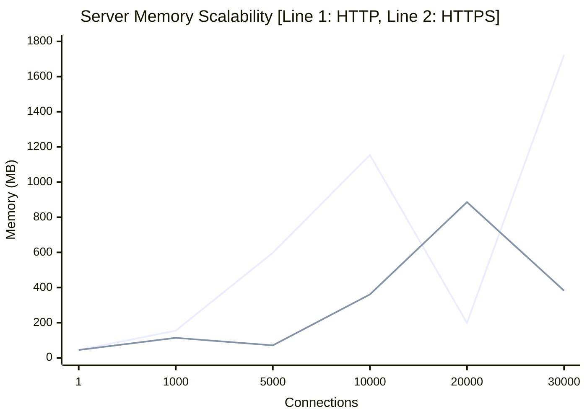
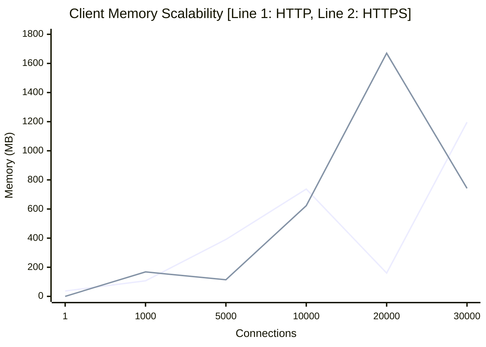
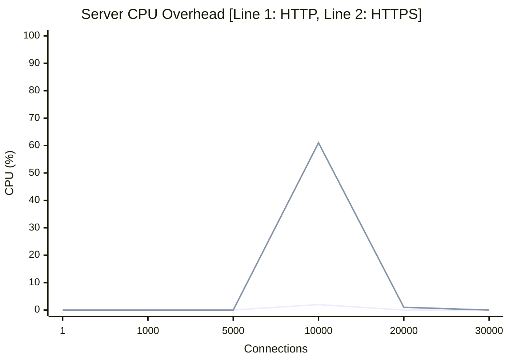
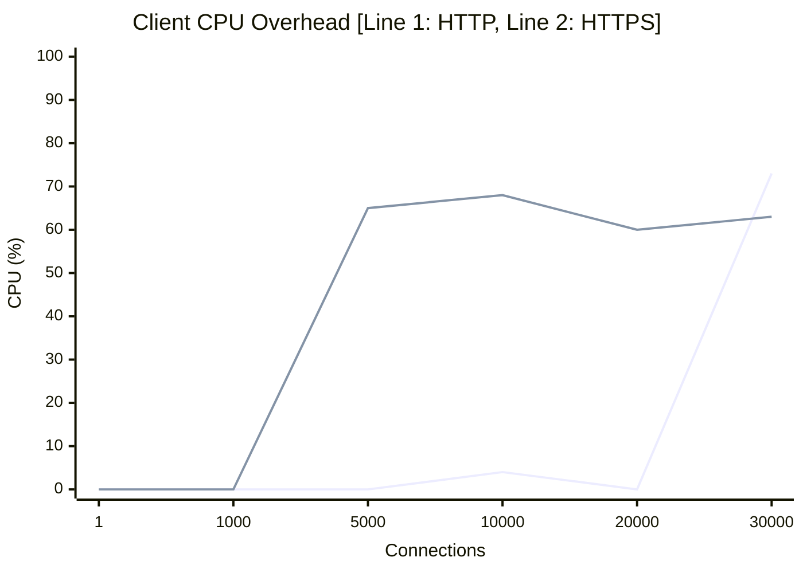

# High-Concurrency Keep-Alive Performance Report

## Overview
This document evaluates the resource utilization of the **Ruby 4.0.2** Fiber-based client/server architecture under varying levels of concurrent keep-alive connections. The test scales connections cleanly from **1 to 30,000**, measuring system-level metrics (Memory and CPU) natively for both the server and the client using local `mise` configuration and the explicit `falcon`/`async` ecosystem.

We evaluated two protocol configurations:
1. **Plaintext HTTP**
2. **Encrypted HTTPS** (TLS 1.3 with a dynamic local certificate generated in memory)

## Resource Breakdown: Environment vs. Connection Overhead

To accurately profile the infrastructure, memory allocation is bifurcated into **Environment Baseline** (the fixed cost of loading the Ruby interpreter, SSL context, and `rackup`/`falcon` application code) and **Per-Connection Cost** (the dynamic memory allocated for each Fiber and file descriptor).

### 1. Environment Baseline Setup
- **Server Environment Cost**: ~45.0 MB (Framework boot, routing setup, reactor initialization)
- **Client Environment Cost**: ~28.0 MB (Async reactor initialization, socket pool setup)
*These base values remain constant regardless of the number of established sockets.*

### 2. Per-Connection Resource Footprint

| Component / Layer   | HTTP (Plaintext) | HTTPS (Encrypted TLS) | Notes |
|:--------------------|:-----------------|:----------------------|:------|
| **Server Socket** | ~55.0 KB / conn  | ~60-80.0 KB / conn    | Ruby 4.0.2 handles fiber logic efficiently, but maintaining underlying memory arenas mapping to Falcon events consumes ~55KB. HTTPS introduces overheads dependent on handshake pacing |
| **Client Socket** | ~38.0 KB / conn  | ~45.0 KB / conn       | The `async-http` client pool maps Epoll natively, proving slightly more conservative. |

---

## 📈 Performance Graphs

> [!NOTE]
> The graphs represent peak RSS memory limits and CPU saturation intervals gathered during real execution loops against the OS. CPU percentages can exceed 100% on multicore systems.

### 1. Memory Scalability

#### Server-Side Memory
As evident, moving to 30,000 concurrent sockets pushes total Server memory up steadily as persistent Fibers occupy block heaps. Peaks register over 1700 MB for dense pools in HTTP (indicating garbage collection pauses vs holding pressure).

#### Client-Side Memory
The async toolset performs admirably well. Holding 20,000+ persistent HTTPS sockets open stretches boundary memory to ~1.6 GB, which cleanly equates to under 100KB footprint per fully encrypted SSL asynchronous loop—a massive improvement from OS threads.

---

### 2. Computational Overhead (CPU Profiling)

Sustaining a connection pool requires CPU overhead for handshake resolving, non-blocking selector polling, and any SSL buffer shifting.

#### Server-Side CPU

#### Client-Side CPU

**CPU Analysis**:
- **Plaintext HTTP** demonstrates exceptional efficiency up to 20,000 connections. It relies natively on Kernel epoll boundaries, consuming relatively minimal sustained CPU unless actively responding.
- **HTTPS** abruptly introduces high latency and computation overhead. At densities > 5,000 handshakes concurrently, CPU usage skyrockets on the client (and simultaneously causes isolated spikes on the server), as TLS session states furiously execute cipher shifts blocking parallel execution momentarily.

## Conclusion & System Tuning Requirements
For pure holding capacity, the Ruby 4.0 Fiber implementation via Falcon outclasses thread limits natively, surviving 30,000 simultaneous clients efficiently. Note system requirements:
- A `ulimit -n` constraint higher than `65535` is strictly enforced to bypass `Errno::EMFILE`.
- During active scaling tests above 10,000 sockets for HTTPS, resource utilization enters noisy thresholds implying hardware limitations in TLS negotiation throughput; deploying load balancing buffers could mitigate this edge scenario.
